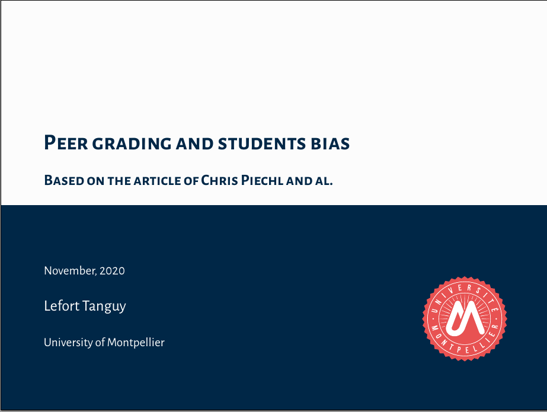

# OrganizationFiles

This repository provides some advice and guidelines for researchers and professors working in applied mathematics, statistics or machine learning. The primal objective is to provide such information for people in my lab, but others might benefit from the resources as well.
You will find a focus on: writing scientific documents (Tex / LaTeX / BibTeX), coding (with Python) and sketching figures with Inkscape.
Feel free to fork the repository (by clicking **Fork** in the top-right corner of the page) and submit pull-request to improve it.

## [Quarto](Quarto/)
In the [Quarto section](Quarto/) is provided:

- A template for a Quarto presentation: [presentation-template](Quarto/presentation-template/)
- An example of a website created with Quarto: [HAX712X](https://josephsalmon.github.io/HAX712X/) with the source code available [here](https://github.com/josephsalmon/HAX712X/blob/main/index.qmd).

## [TeX / LaTeX / BibTeX](tex/)
In the [LaTeX section](tex/) is provided:

- Large harmonized reference file for my group : [references_all.bib](tex/biblio/references_all.bib)

- Snippets used for LaTeXing with Sublime text (XXX TODO: to be described for VSCode too!).

- LaTeX / TeX templates and examples:

| [article.tex](tex/draft-article/article.tex)                                                   | [beamer_js.tex](tex/draft-beamer/beamer_js.tex)                                                   | [beamer_tl.tex](tex/draft-beamer/beamer_tl.tex)                                                   | [exam.tex](tex/draft-exam/exam.tex)                                                     | [scribe.tex](tex/draft-scribe/scribe.tex)                                                   |
| ---------------------------------------------------------------------------------------------- | ------------------------------------------------------------------------------------------------- | ------------------------------------------------------------------------------------------------- | --------------------------------------------------------------------------------------- | ------------------------------------------------------------------------------------------- |
|  |  |  |  |  |

## [Python](python/draft-package/)
In section [draft-package](python/draft-package/)
an example of a Python package
 to start a new project.
If you are looking for more help on (scientific) Python I can only recommend my course with [B. Charlier](https://imag.umontpellier.fr/~charlier) available at [https://josephsalmon.github.io/HAX712X/]().

I also provide in [matplotlib](python/matplotlib/) a style file to use with matplotlib, for clean figures harmonization.

## Reproducibility/Replicability

These are key concept for modern science.
See for instance Konrad Hinsen's blog post on the topic: [https://khinsen.net/keynote-acm-rep-24/transcript.html]().

More motivational reading can be found in the papers by D. Donoho: [50 years of data science](https://www.tandfonline.com/doi/full/10.1080/10618600.2017.1384734) and the more recent [Data Science at the Singularity](https://hdsr.mitpress.mit.edu/pub/g9mau4m0/release/2).

## [Images and Inkscape](inkscape/)
In the [Images and Inkscape](inkscape/) section, I am giving some insights on using images in science and communications, and discuss why **Inkscape** is an incredible tool to master for a PhD student or a modern researcher.
About colors, it is interesting to know some basics rules (see https://matthewstrom.com/writing/how-to-pick-the-least-wrong-colors/) and to be aware of colorblind people.
A last important point is the creation of palettes for choosing the right colors. For that [http://paletton.com](http://paletton.com/#uid=1000u0kllllaFw0g0qFqFg0w0aF) could help a lot.
As a preliminary guidline on which format to use (jpg, png, gif, svg, pdf, etc.), see this page [Interneting Is Hard](https://internetingishard.netlify.app/html-and-css/links-and-images/#image-formats).

## Web/html
You can create your personal website seamlessly by following the instructions [here](https://wowchemy.com/templates/).
It is also probably important to start having some basic knowledge in html and css, see for instance
[Interneting Is Hard](https://internetingishard.netlify.app/html-and-css/introduction/).

## [Advice (mostly) for PhD students](guidelines/)
In section [guidelines](guidelines/), standard information and work practices for working in my the group is provided. Information on summer schools, funding tips for traveling, etc. is also given.

## Calendar / polls / etc.

To create polls with unique possibilities (say you want the people you contact to choose one single choice, on a first-come, first-served basis) `Evento` is a good solution [https://evento.renater.fr](), see help [here](https://prim76.ac-normandie.fr/IMG/pdf/planifier_des_rendez-vous_evento_modifie_erun_76.pdf).

Use a calendar, a paper or an online version is up to you.

## Contributors

- Joseph Salmon: http://josephsalmon.eu

- Tanguy Lefort: https://tanglef.github.io/

- Mathurin Massias: https://mathurinm.github.io/

- Quentin Bertrand: https://qb3.github.io/

- Florent Bascou: https://bascouflorent.github.io/

- Nidham Gazagnadou: https://ngazagna.github.io/

- Camille Garcin: https://garcinc.github.io/Camille-Garcin/

