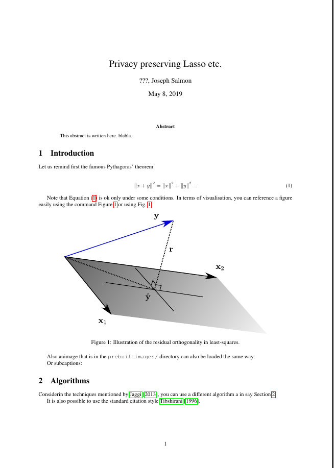
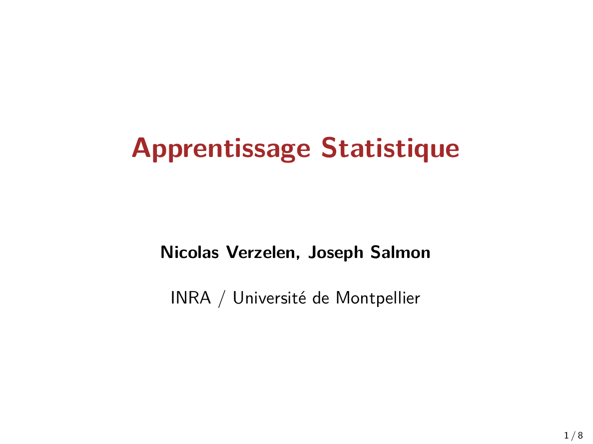
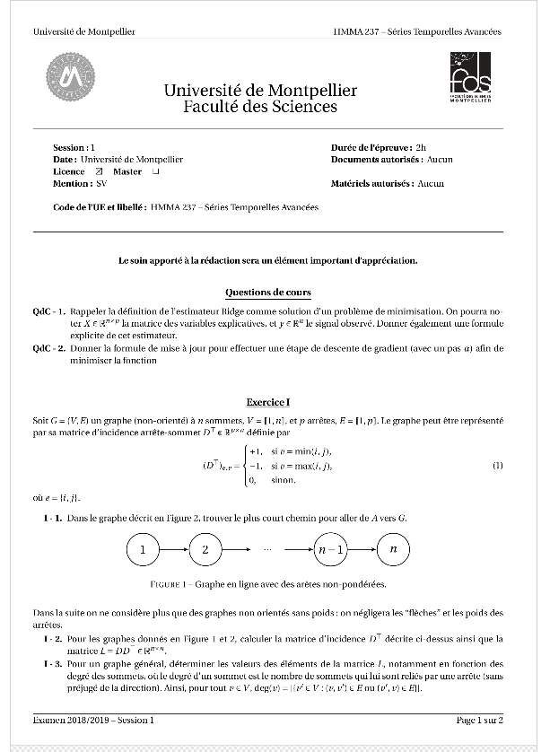

# TeX / LaTeX / BibTeX

## Content

- References harmonized for my group in (a huge) .bib file: [references_all.bib](biblio/references_all.bib)

- Snippets used for LaTeXing with Sublime (to be adapted for VSCode).

- TeX templates and examples

|[article.tex](draft-article/article.tex)|[beamer.tex](draft-beamer/beamer.tex) | [exam.tex](draft-exam/exam.tex)| [scribe.tex](draft-scribe/scribe.tex) |
| ----------- | ----------- |----------- |----------- |
|[](draft-article/article.tex)|[](draft-beamer/beamer.tex)|[](draft-exam/exam.tex)|[](draft-scribe/scribe.tex)|


## Text Editor 

Among the useful tools a modern editor (like [VSCode](https://code.visualstudio.com/) or [Sublime Text](https://www.sublimetext.com/).
On top of that useful tools connected to LaTeX include:
, is mandatory.
In particular useful tools include 
- snippets
- multi-cursors 
- forward/backward search: so you can click the generated pdf and find the tex location in your document.


## Additional tools

- https://www.tablesgenerator.com/ : to create LaTeX tables from copy/paste values or .csv files
- Inkscape (see for more information in the [Inkscape](../inkscape/README.md) section): useful for sketching figures with, especially with the [TexText](https://inkscape.org/~jcwinkler/%E2%98%85textext) extension.


## Latex tips

1. Tools for Latex: Table generator http://www.tablesgenerator.com/ and  OCR for Latex formulas https://mathpix.com/

2. **Warning** font style :
```math
SNR \neq $SNR$
```

3. Add space on which you optimize:
```math
\min_{x \in X}
```
is **good**,
```math
\min_{x}
```
is *forbidden*.

4. **Always use**  *\enspace* at the of align/equation environments; e.g., :
```math
\begin{align}
x + 3 \enspace.
\end{align}
```
and not
```math
\begin{align}
x + 3.
\end{align}


## English rules
1. **HARMONIZE notation**
1. isn't -> **is not**, can't -> **can not**, let's -> **let us**
1. **Do not use** "I", "my". **Use** "royal", "we".
1. **Never** start a sequence by a formula.
1. **Use . , ;** at the end of a formula.
1. **Refrain** for using "will".
1. "permit" no so popular, **use** "allow".
1. **Number should often be a letter**: "3 times larger" -> "three times larger"
1. Notation without **s** for math.
1. Present tense, third person: "he, she, it", **add* an "s" at the end.

1. **Define** (almost) all "symbols you use".
1. **Define** concepts in correct order.
